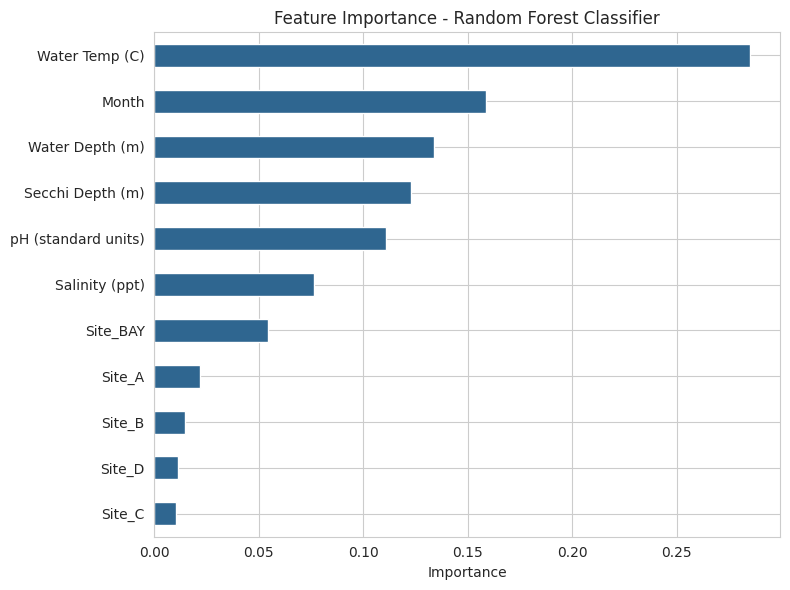
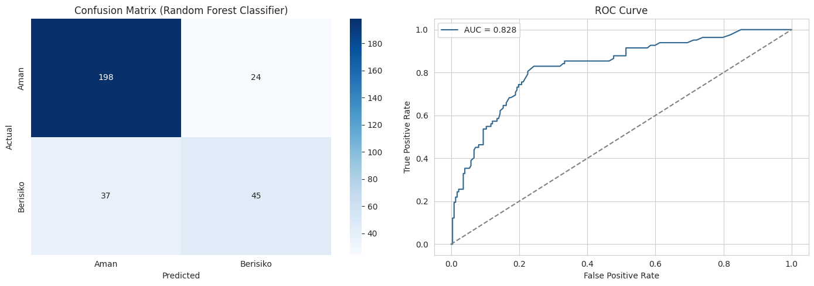
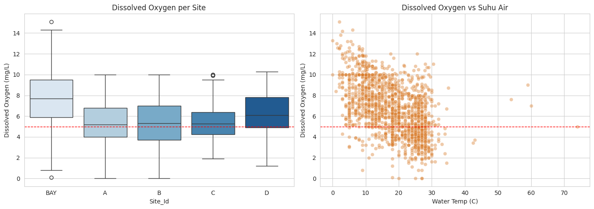

# Predicting Hypoxia Risk: When Water Warms, Oxygen Vanishes


> **View the visual summary & business impact on my [Portfolio Website ↗]([MASUKKAN_LINK_WEBSITE_PORTOPOLIO_KAMU_DISINI])**

## 📌 Business & Ecological Problem
Hypoxia (oxygen-depleted water) is a lethal threat to aquatic ecosystems. Dissolved Oxygen (DO) is the single most critical parameter for detecting this risk. However, in our 31-year monitoring dataset, **DO was missing in 35.9% of all observations**. 

Ironically, the highest-risk periods (peak summer) were often the times with the most missing data, creating a dangerous environmental blind spot. The objective of this project is to build a Machine Learning classification model capable of estimating Hypoxia Risk (Safe vs. At-Risk) using other, more consistently measured parameters (like water temperature, depth, and season) when direct DO measurements are unavailable.

## 🗂️ Data & Technical Methodology
Analyzed water quality data spanning from 1989 to 2019 across 5 monitoring stations.

**Rigorous Modeling Decisions:**
1. **Target Variable Integrity:** Made the deliberate decision *NOT* to impute the missing target variable (DO). Rows without DO were excluded from the training set. Filling 35.9% of labels with statistical estimates would have trained the model to mimic its own imputation patterns rather than real-world risk.
2. **Skewness-Based Imputation:** For feature variables, I used median imputation for highly skewed columns (Salinity skewness=1.97, Secchi Depth skewness=7.06) and mean imputation for symmetric columns (Water Temp, Air Temp).
3. **Feature Engineering:** Extracted temporal features (`Month`, `Season`) to capture cyclical hypoxia risk. Created the binary target `Risiko_Hipoksia` using the standard 5 mg/L survival threshold.
4. **Model Selection:** Compared Logistic Regression vs. Random Forest Classifier using `StratifiedKFold` cross-validation. Random Forest was selected for its superior capability to handle non-linear environmental relationships.

---

## 📊 Key Insights & Model Evaluation

### 1. Water Temperature is the Strongest Predictor
Feature importance analysis reveals that Water Temperature dominates the model's decision-making process, contributing **28.5%** to the predictions. The peak summer months create the highest hypoxia risk windows.


*(Insight: Month/Season also heavily influence the risk [15.9%]. Monitoring schedules should be heavily seasonal, not uniformly spread year-round).*

### 2. Model Performance: ROC-AUC 0.84
The Random Forest model achieved an impressive **ROC-AUC score of 0.84**, proving its reliability in distinguishing between Safe and At-Risk conditions without direct oxygen measurements.


*(Insight: The model successfully acts as a retroactive screening tool to fill the 35.9% blind spot in historical data).*

### 3. The 5 mg/L Danger Threshold
Of the 1,519 valid observations, 26.9% fell below the safe 5 mg/L threshold. The scatter pattern below confirms the strong inverse relationship between rising water temperatures and collapsing oxygen levels.


*(Insight: Freshwater zones showed significantly thinner oxygen margins, sitting dangerously close to the 5 mg/L threshold compared to saline zones).*

---

## 💡 Monitoring Recommendations
1. **Targeted Seasonal Monitoring:** Reallocate monitoring budgets to ensure 100% DO measurement completeness during the peak summer months.
2. **Freshwater Sensor Deployment:** Prioritize the installation of real-time continuous DO sensors at freshwater monitoring stations where oxygen margins are critically thin.
3. **Threshold Calibration:** In a safety context, missing a hypoxia event is worse than a false alarm. The model's decision threshold should be lowered to increase `Recall` for the At-Risk class.

## 📂 Repository Structure
```text
├── data/
│   └── Water_Quality.csv              # Original 31-year monitoring dataset
├── images/                            # Evaluation metrics & EDA charts
├── notebooks/
│   └── Water_Quality.ipynb            # Main Data Cleaning & Modeling notebook
├── requirements.txt                   # Dependencies
└── README.md
```

## 🚀 How to Run
1. Clone this repository: `git clone https://github.com/Daaffaaisa/Water-Quality-Prediction-Using-Machine-Learning.git`
2. Install dependencies: `pip install -r requirements.txt`
3. Run the Jupyter Notebook in the notebooks/ directory to view the modeling pipeline.
